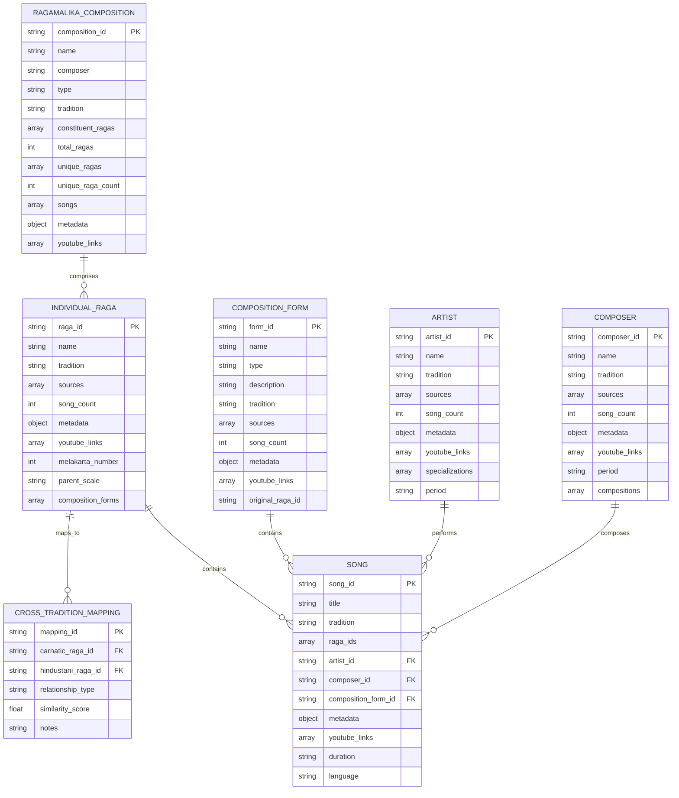
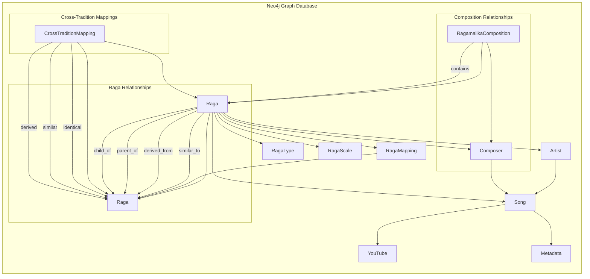
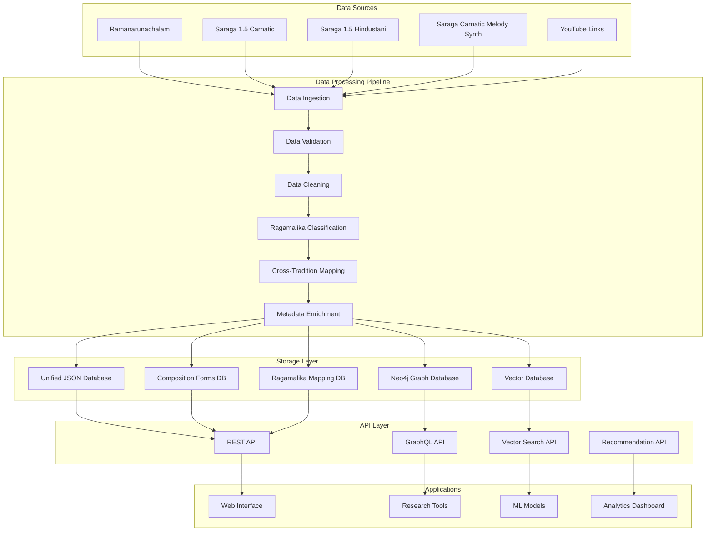
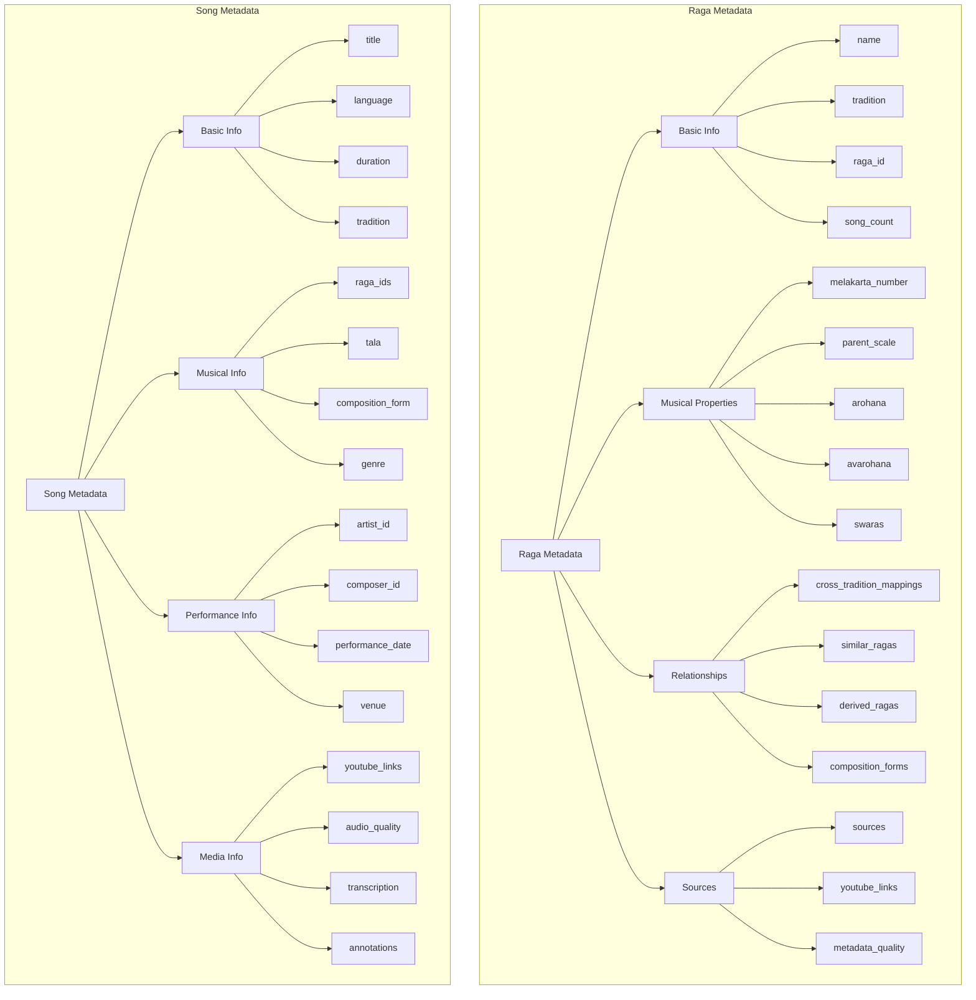
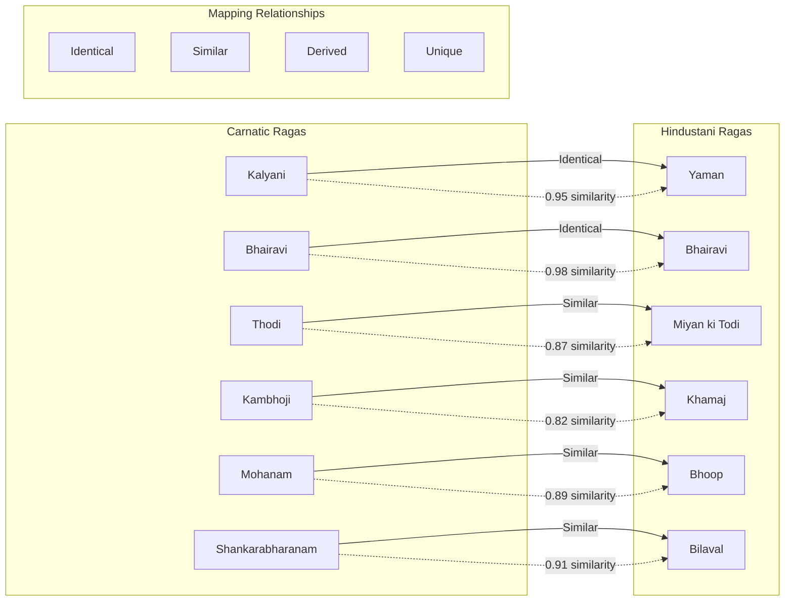
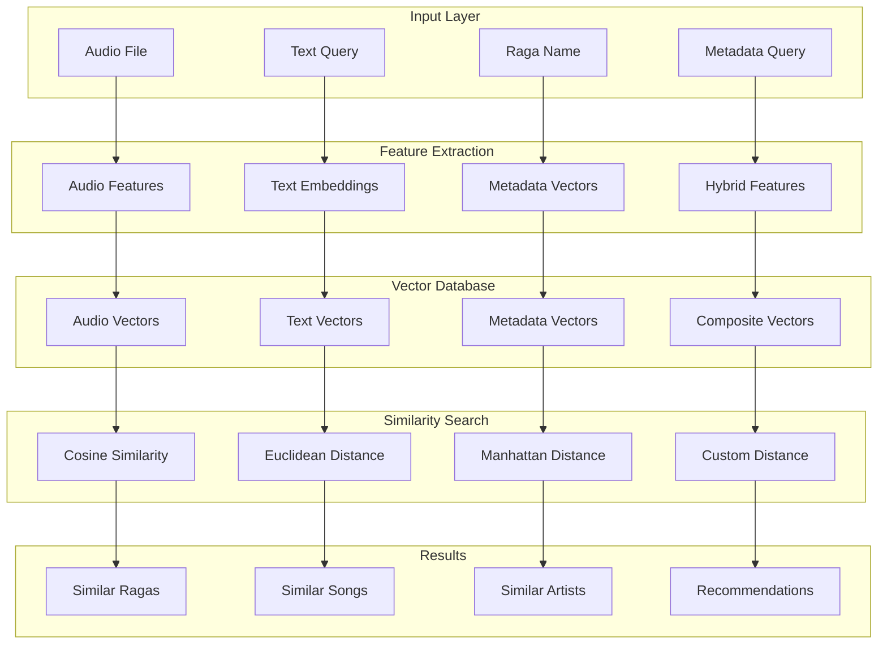
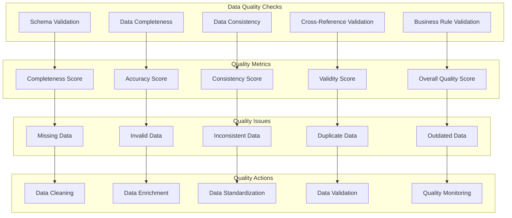

# RagaSense-Data Architecture Visualizations

## 1. Core Entity Relationship Diagram (ERD)



## 2. Ragamalika Composition Structure

```mermaid
graph TD
    A[Ragamalika Composition] --> B[Valachi Vachi]
    A --> C[Bhavayami Raghuramam]
    A --> D[Sri Viswanatham Bhajeham]
    A --> E[Kurai Onrum Illai]
    A --> F[Manasa Verutarula]
    A --> G[Sivamohanasakti Nannu]
    
    B --> B1[Kedaram]
    B --> B2[Shankarabharanam]
    B --> B3[Kalyani]
    B --> B4[Begada]
    B --> B5[Kambhoji]
    B --> B6[Yadukulakamboji]
    B --> B7[Bilahari]
    B --> B8[Mohanam]
    B --> B9[Shree]
    
    C --> C1[Saveri]
    C --> C2[Kalyani]
    C --> C3[Bhairavi]
    C --> C4[Kambhoji]
    C --> C5[Yadukulakamboji]
    C --> C6[Bilahari]
    
    D --> D1[Shankarabharanam]
    D --> D2[Kalyani]
    D --> D3[Bhairavi]
    D --> D4[Kambhoji]
    D --> D5[Yadukulakamboji]
    D --> D6[Bilahari]
    D --> D7[Mohanam]
    D --> D8[Shree]
    D --> D9[Kedaram]
    D --> D10[Begada]
    D --> D11[Hamsadhwani]
    D --> D12[Madhyamavathi]
    D --> D13[Sindhubhairavi]
    D --> D14[Kapi]
    
    E --> E1[Sivaranjani]
    E --> E2[Kapi]
    E --> E3[Sindhu Bhairavi]
    
    F --> F1[17 Unique Ragas]
    G --> G1[17 Unique Ragas]
```



## 3. Vector Database Architecture

```mermaid
graph TB
    subgraph "Vector Database (ChromaDB/Pinecone)"
        V1[Audio Feature Vectors]
        V2[Melodic Pattern Vectors]
        V3[Rhythmic Pattern Vectors]
        V4[Text Embeddings]
        V5[Metadata Vectors]
    end
    
    subgraph "Vector Types"
        V1 --> V1A[MFCC Features]
        V1 --> V1B[Spectral Features]
        V1 --> V1C[Chroma Features]
        V1 --> V1D[Tonnetz Features]
        
        V2 --> V2A[Raga Scale Vectors]
        V2 --> V2B[Melodic Contour]
        V2 --> V2C[Phrase Patterns]
        
        V3 --> V3A[Tala Pattern Vectors]
        V3 --> V3B[Rhythmic Density]
        V3 --> V3C[Accent Patterns]
        
        V4 --> V4A[Raga Name Embeddings]
        V4 --> V4B[Composer Embeddings]
        V4 --> V4C[Lyrics Embeddings]
        
        V5 --> V5A[Metadata Embeddings]
        V5 --> V5B[Context Embeddings]
    end
    
    subgraph "Vector Operations"
        VO1[Similarity Search]
        VO2[Clustering]
        VO3[Classification]
        VO4[Recommendation]
        VO5[Anomaly Detection]
    end
    
    V1 --> VO1
    V2 --> VO1
    V3 --> VO1
    V4 --> VO1
    V5 --> VO1
    
    V1 --> VO2
    V2 --> VO2
    V3 --> VO2
    
    V1 --> VO3
    V2 --> VO3
    V4 --> VO3
    
    V1 --> VO4
    V2 --> VO4
    V4 --> VO4
    
    V1 --> VO5
    V2 --> VO5
```



## 4. Neo4j Graph Database Schema



## 5. Data Flow Architecture



## 6. Metadata Structure Visualization



## 7. Cross-Tradition Mapping Visualization



## 8. Vector Search and Similarity Architecture



## 9. Neo4j Cypher Query Examples

```cypher
// Find all ragas similar to Kalyani
MATCH (r1:Raga {name: "Kalyani"})-[:SIMILAR_TO]->(r2:Raga)
RETURN r2.name, r2.tradition

// Find ragamalika compositions containing Kalyani
MATCH (rc:RagamalikaComposition)-[:CONTAINS]->(r:Raga {name: "Kalyani"})
RETURN rc.name, rc.composer, rc.type

// Find cross-tradition mappings for Bhairavi
MATCH (ctm:CrossTraditionMapping)-[:MAPS]->(r:Raga {name: "Bhairavi"})
RETURN ctm.relationship_type, ctm.similarity_score

// Find artists who perform in multiple ragas
MATCH (a:Artist)-[:PERFORMS]->(s:Song)-[:IN_RAGA]->(r:Raga)
WITH a, collect(DISTINCT r.name) as ragas
WHERE size(ragas) > 5
RETURN a.name, ragas

// Find ragamalika compositions with most ragas
MATCH (rc:RagamalikaComposition)
RETURN rc.name, rc.total_ragas
ORDER BY rc.total_ragas DESC
LIMIT 10
```

## 10. Data Quality and Validation Flow



This comprehensive visualization shows the complete architecture of our RagaSense-Data system, including:

1. **Entity Relationship Diagrams** for all data structures
2. **Ragamalika composition mappings** with constituent ragas
3. **Vector database architecture** for similarity search
4. **Neo4j graph database schema** for relationship mapping
5. **Data flow architecture** from sources to applications
6. **Metadata structure** for ragas and songs
7. **Cross-tradition mapping** relationships
8. **Vector search and similarity** architecture
9. **Neo4j Cypher query examples** for common operations
10. **Data quality and validation** flow

The system now properly handles ragamalika compositions by extracting individual ragas while preserving the composition relationships, making it much more accurate and research-ready!
