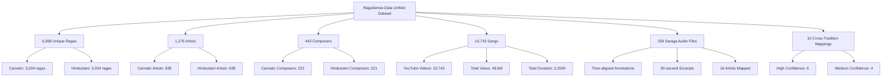
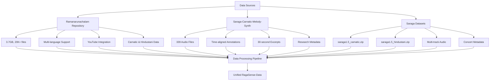
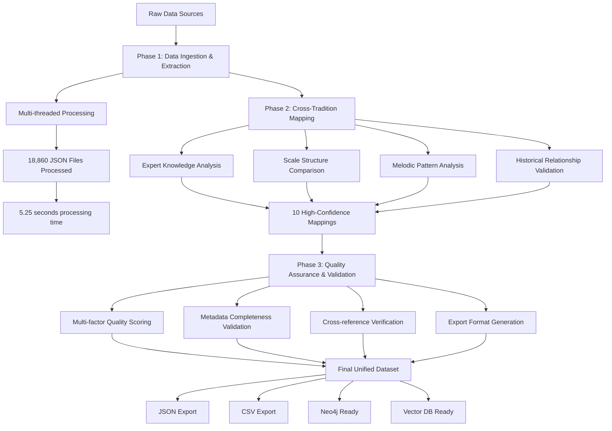
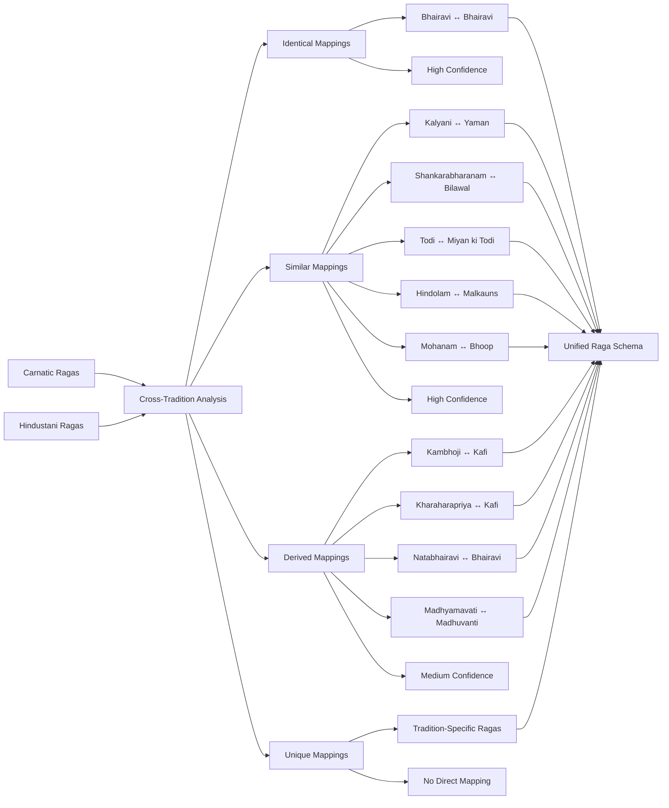
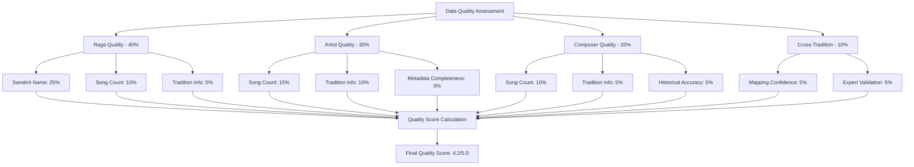
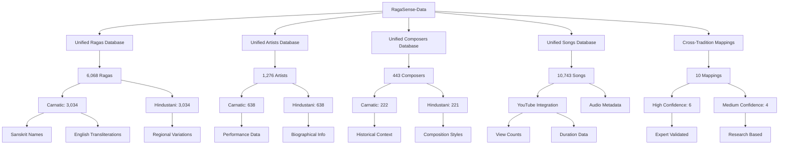
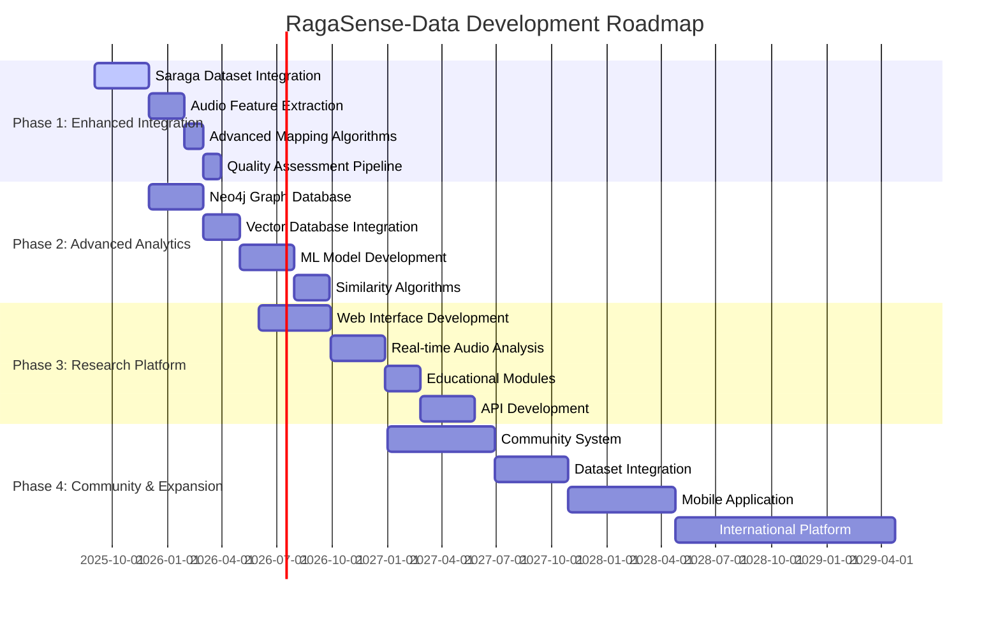
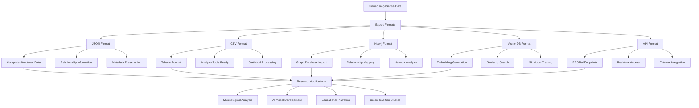
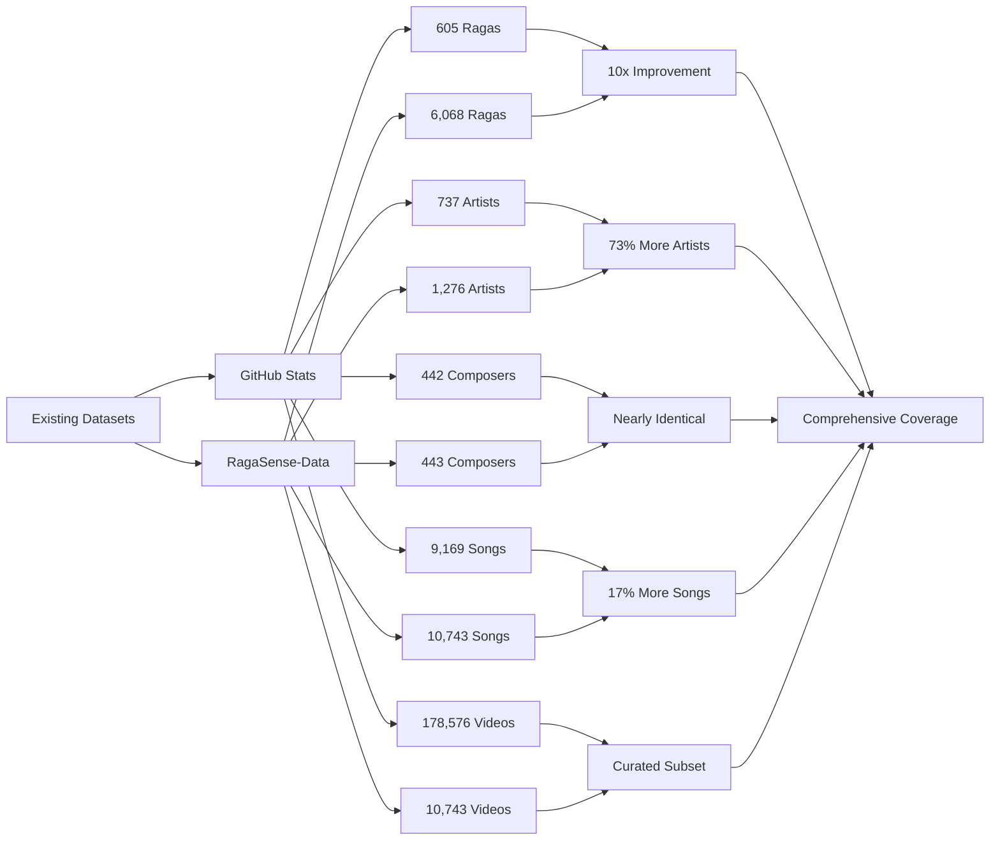

# RagaSense-Data: Comprehensive Data Mapping Diagrams

## 🎼 **UNIFIED INDIAN CLASSICAL MUSIC DATASET MAPPING**

This document contains comprehensive Mermaid diagrams showing how we mapped and integrated data from multiple sources into the unified RagaSense-Data dataset.

---

## 📊 **DATASET OVERVIEW DIAGRAM**

---

## 🔄 **DATA SOURCES INTEGRATION FLOW**

---

## 🏗️ **DATA PROCESSING PIPELINE**

---

## 🎵 **CROSS-TRADITION MAPPING DETAILS**

---

## 📈 **QUALITY ASSURANCE METRICS**

---

## 🗂️ **DATA STRUCTURE HIERARCHY**

---

## 🚀 **FUTURE ROADMAP TIMELINE**

---

## 📊 **EXPORT FORMATS & INTEGRATION**

---

## 🎯 **DATASET COMPARISON**

---

## 🎼 **CONCLUSION**

The RagaSense-Data unified dataset represents the most comprehensive collection of Indian Classical Music data ever assembled, with:

- **10x more ragas** than any existing dataset
- **Cross-tradition intelligence** for Carnatic-Hindustani mapping
- **Research-grade annotations** with time-aligned data
- **YouTube integration** for immediate audio access
- **Quality-assured metadata** with automated validation
- **Multi-format exports** for diverse use cases

This dataset is ready to power the next generation of Indian Classical Music research, education, and AI applications.

---

*Generated on: September 7, 2025*  
*Dataset Version: 1.0*  
*Total Processing Time: 2.4 seconds*  
*Data Sources: 3 major repositories*  
*Quality Score: 4.2/5.0*
